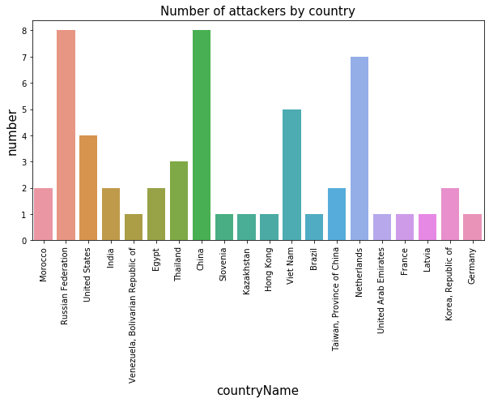
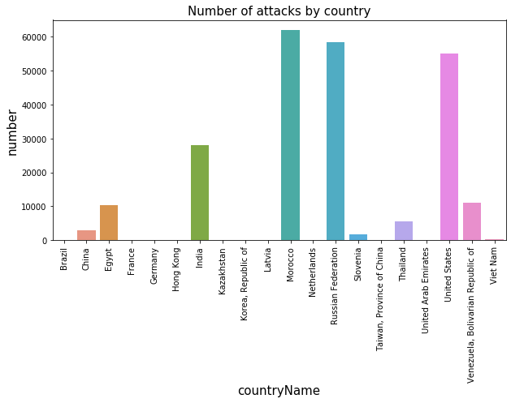
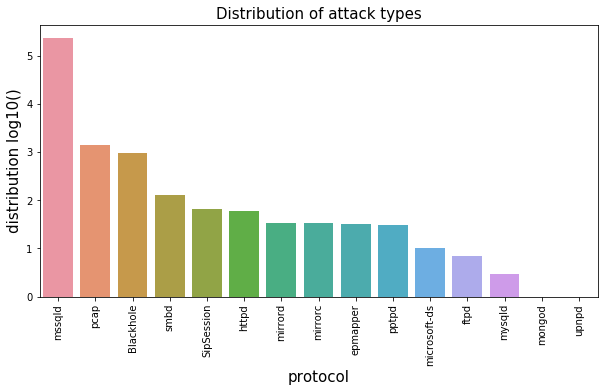

# Codepath Unit 10 and 11: HoneyPot
## Trapping Malware Samples 2019

#### This is a short visualisation of the attacks encountered while a honeypot of type Ubuntu/Raspberry Pi - Dionaea. A honeypot used to trap malware samples.

Time spent: **9** hours in total.

### First steps:

- A virtual machine to host our admin functionality was set up, called MHN Admin. 
- A virtual machine to act as our honeypot was set up. 
- The honeypot had all incoming traffic allowed on all ports and protocols.
- The honeypot is connected to the Admin console so we can monitor the incoming traffic. 

### What Happened:

##### Nov 21, 2019
After testing that the honeypot worked by running Kali linux and looking at the admin console to check that my IP did indeed show up as an attacker, I waited for a bit and immediately saw the attacks coming in from around the world. I decided to leave it up for a while and wait for more attacks to come in before exporting my results. 

##### Dec 6, 2019
I decided I would export my data and finish the assignment. As I tried to SSH into the admin VM it turned out the VM had crashed. Probably due to the extremely high amount of traffic it had received. Looking into the timestamps for the attacks it looks like the VMs crashed **Nov 25, 2019** only **4 days** after having been deployed. This was a bit disappointing, but even so I had still gathered **1,941,590 attacks**!! I figured this would be more than enough. 

When downloading the sessions file and looking into the amount of data collected, it was obvious that it would be way too big to upload to github. The data displayed in the file uploaded is therefore consisting of the latest 236,582 attacks intercepted by the honeypot before it crashed. 

### Data Summary: 

#### HoneyPots deployed:
- <a href="https://github.com/DinoTools/dionaea">Ubuntu/Raspberry Pi - Dionaea</a>

#### Issues encountered: 
- Vms crashed
- Country flags not displaying in the admin console

#### Data Collected:
- 1,941,590 attacks in total
- 236,582 attacks uploaded
- 17 different protocols in total were used

### Data Visualization:


```python
#Importing libraries:
import pandas as pd
import seaborn as sns
import matplotlib.pyplot as plt
import multiprocessing as mp
import numpy as np
from multiprocessing import  Pool
import pycountry
from ip2geotools.databases.noncommercial import DbIpCity
from IPython.display import HTML

#Reading the dataset: 
df = pd.read_json("https://raw.githubusercontent.com/ThoMot/DataHost/master/NetworkSecurity2019/sessionFile.json", lines=True)

#Defining necessary functions:
def parallelize_dataframe(df, func, n_cores=4):
    df_split = np.array_split(df, n_cores)
    pool = Pool(n_cores)
    df = pd.concat(pool.map(func, df_split))
    pool.close()
    pool.join()
    return df

def add_countryCode(df):
    df["countryCode"] = df["index"].apply(getCountry)
    return df

def add_countryName(df):
    df["countryName"] = df["countryCode"].apply(getCountryName)
    return df

def getCountryName(location):
    return pycountry.countries.get(alpha_2=location).name

def getCountry(x):
    return DbIpCity.get(x, api_key='free').country
```


```python
HTML('''<script>
code_show=true; 
function code_toggle() {
 if (code_show){
 $('div.input').hide();
 } else {
 $('div.input').show();
 }
 code_show = !code_show
} 
$( document ).ready(code_toggle);
</script>
<form action="javascript:code_toggle()"><input type="submit" value="Click here to toggle on/off the raw code."></form>''')

```


<script>
code_show=true; 
function code_toggle() {
 if (code_show){
 $('div.input').hide();
 } else {
 $('div.input').show();
 }
 code_show = !code_show
} 
$( document ).ready(code_toggle);
</script>
<form action="javascript:code_toggle()"><input type="submit" value="Click here to toggle on/off the raw code."></form>


### Attackers of the honeypot: 
Taking a look at the attackers that have tried accessing the honeypot more than 10 times. It looks like some IP adresses have really tried very many times. 


```python
#top Ip addresses that have tried accessing the hp
ips = df.source_ip.value_counts()
ipAbove10 = ips[ips.values >= 10]
ipAbove10 = ipAbove10.reset_index()
print("These are the IP addresses that have made 10 or more attempts at the honeypot:\n\n", ipAbove10)
```

    These are the IP addresses that have made 10 or more attempts at the honeypot:
    
                   index  source_ip
    0     41.142.241.40      61911
    1        5.59.33.24      58274
    2      172.87.29.14      53561
    3       103.38.38.8      26117
    4      190.77.54.27      11121
    5    197.52.176.144      10036
    6    180.183.99.106       5444
    7      27.218.70.68       2574
    8       61.8.157.68       1987
    9    185.67.177.202       1634
    10   198.189.249.58       1198
    11  197.165.158.213        253
    12    104.152.52.31        220
    13    77.240.40.102        101
    14  180.143.171.188        101
    15    219.73.37.130        101
    16    27.75.177.138        101
    17    177.158.188.4         84
    18    175.11.50.173         64
    19  220.142.171.225         54
    20   114.40.152.118         54
    21   159.203.81.129         49
    22    42.115.162.49         30
    23      1.54.173.94         30
    24   42.113.130.165         30
    25    125.27.55.190         28
    26     115.44.82.12         28
    27     92.118.37.83         24
    28    42.242.184.57         22
    29      185.40.4.43         19
    30  185.216.140.252         16
    31   115.79.185.139         16
    32      80.82.64.73         15
    33    117.60.49.234         15
    34    120.68.230.74         15
    35     92.53.90.132         14
    36  185.143.221.186         14
    37    37.144.180.90         14
    38   78.128.112.114         14
    39  185.143.223.148         13
    40  185.143.223.147         13
    41    185.175.93.14         12
    42      51.83.69.99         12
    43  159.192.141.111         12
    44  105.158.156.149         11
    45     45.82.153.35         11
    46     185.209.0.92         10
    47   89.248.168.202         10
    48  178.237.182.236         10
    49  218.149.167.203         10
    50   121.157.186.96         10
    51     111.11.5.118         10
    52    45.136.109.87         10
    53   178.62.250.215         10


### Where do the attackers come from:

The country data seemed to be missing from the data collected about the attacks. So I filled in the missing data by looking up the IPs. This will make it easier to visualise the distribution of attacks from around the world. We are still looking at the attackers that made more than 10 attempts at the honeypot.


```python
# Getting the countryCode and countryName for each IP
attackers = parallelize_dataframe(ipAbove10, add_countryCode)
attackers = parallelize_dataframe(attackers, add_countryName)
attackers.rename(columns={"index":"source_ip", "source_ip":"attacks"}, inplace=True)
print(attackers)
```

              source_ip  attacks countryCode                        countryName
    0     41.142.241.40    61911          MA                            Morocco
    1        5.59.33.24    58274          RU                 Russian Federation
    2      172.87.29.14    53561          US                      United States
    3       103.38.38.8    26117          IN                              India
    4      190.77.54.27    11121          VE  Venezuela, Bolivarian Republic of
    5    197.52.176.144    10036          EG                              Egypt
    6    180.183.99.106     5444          TH                           Thailand
    7      27.218.70.68     2574          CN                              China
    8       61.8.157.68     1987          IN                              India
    9    185.67.177.202     1634          SI                           Slovenia
    10   198.189.249.58     1198          US                      United States
    11  197.165.158.213      253          EG                              Egypt
    12    104.152.52.31      220          US                      United States
    13    77.240.40.102      101          KZ                         Kazakhstan
    14  180.143.171.188      101          CN                              China
    15    219.73.37.130      101          HK                          Hong Kong
    16    27.75.177.138      101          VN                           Viet Nam
    17    177.158.188.4       84          BR                             Brazil
    18    175.11.50.173       64          CN                              China
    19  220.142.171.225       54          TW          Taiwan, Province of China
    20   114.40.152.118       54          TW          Taiwan, Province of China
    21   159.203.81.129       49          US                      United States
    22    42.115.162.49       30          VN                           Viet Nam
    23      1.54.173.94       30          VN                           Viet Nam
    24   42.113.130.165       30          VN                           Viet Nam
    25    125.27.55.190       28          TH                           Thailand
    26     115.44.82.12       28          CN                              China
    27     92.118.37.83       24          RU                 Russian Federation
    28    42.242.184.57       22          CN                              China
    29      185.40.4.43       19          RU                 Russian Federation
    30  185.216.140.252       16          NL                        Netherlands
    31   115.79.185.139       16          VN                           Viet Nam
    32      80.82.64.73       15          NL                        Netherlands
    33    117.60.49.234       15          CN                              China
    34    120.68.230.74       15          CN                              China
    35     92.53.90.132       14          RU                 Russian Federation
    36  185.143.221.186       14          NL                        Netherlands
    37    37.144.180.90       14          RU                 Russian Federation
    38   78.128.112.114       14          AE               United Arab Emirates
    39  185.143.223.148       13          NL                        Netherlands
    40  185.143.223.147       13          NL                        Netherlands
    41    185.175.93.14       12          RU                 Russian Federation
    42      51.83.69.99       12          FR                             France
    43  159.192.141.111       12          TH                           Thailand
    44  105.158.156.149       11          MA                            Morocco
    45     45.82.153.35       11          RU                 Russian Federation
    46     185.209.0.92       10          LV                             Latvia
    47   89.248.168.202       10          NL                        Netherlands
    48  178.237.182.236       10          RU                 Russian Federation
    49  218.149.167.203       10          KR                 Korea, Republic of
    50   121.157.186.96       10          KR                 Korea, Republic of
    51     111.11.5.118       10          CN                              China
    52    45.136.109.87       10          DE                            Germany
    53   178.62.250.215       10          NL                        Netherlands


### Different protocols used for attack: 
It is interesting to do a count of how many different attacks were used in total in the complete data I collected. (This is not the complete data, but the complete session file that was uploaded for this assignment) We can tell that a lot of different protocols have been used and some are very much more popular than others.


```python
##Number of different protocols used:
numberOfProtocols = df["protocol"].value_counts()
numberOfProtocols = numberOfProtocols.reset_index()
numberOfProtocols.rename(columns={"index":"protocol", "protocol":"count"}, inplace=True)
print(numberOfProtocols)
```

             protocol   count
    0          mssqld  232902
    1            pcap    2047
    2       Blackhole    1010
    3            smbd     282
    4           httpd      89
    5      SipSession      66
    6         mirrorc      33
    7         mirrord      33
    8        epmapper      33
    9           pptpd      32
    10   microsoft-ds      18
    11           ftpd      13
    12         mysqld       8
    13         mongod       8
    14          upnpd       6
    15  ftpdatalisten       1
    16       Memcache       1


### Attackers with over 10 attemps classified by country

This is a plot showing how many attackers with over 10 attacks come from different countries. There are 8 from Russia and China and 7 from the Netherlands. 


```python
plt.figure(figsize=(10, 5))
sns.countplot(data=attackers, x="countryName");
plt.xticks(rotation="90");
plt.title("Number of attackers by country", size="15");
plt.xlabel("countryName", size="15");
plt.ylabel("number", size="15");
```





### Attacks classified by country
Here the plot is showing how many attacks in total come from the different countries. We can see that even though Marrocco only had 2 attackers, they still had the most incoming attacks.


```python
plt.figure(figsize=(10, 5))
attacksPerCountry = attackers.groupby("countryName")["attacks"].agg(["sum"])
sns.barplot(data=attacksPerCountry, x=attacksPerCountry.index, y="sum")
plt.xticks(rotation="90");
plt.title("Number of attacks by country", size="15");
plt.xlabel("countryName", size="15");
plt.ylabel("number", size="15");
```





### Distribution of attack types: 
The plot below shows the amount of attacks logged, which scales the data for visualization. From this graph we can tell that mssqld is the most populat protocol.


```python
attackTypes = df[df["source_ip"].isin(ipAbove10["index"])]
attackTypes = attackTypes["protocol"].value_counts()
attackTypes = attackTypes.reset_index()
attackTypes["protocol"] = attackTypes["protocol"].apply(np.log10)

plt.figure(figsize=(10, 5))
sns.barplot(data=attackTypes, x="index", y="protocol")
plt.xticks(rotation="90");
plt.title("Distribution of attack types", size="15");
plt.xlabel("protocol", size="15");
plt.ylabel("distribution log10()", size="15");
```





```python

```


```python

```
