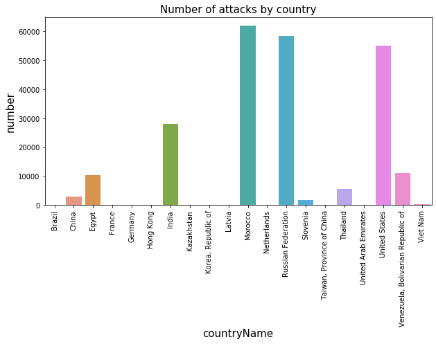

# Codepath Unit 10 and 11: HoneyPot
## Trapping Malware Samples 2019

#### This is a short visualisation of the attacks encountered while a honeypot of type Ubuntu/Raspberry Pi - Dionaea. A honeypot used to trap malware samples.

Author: Thora Mothes

Time spent: **9** hours in total.

### First steps:

- A virtual machine to host our admin functionality was set up, called MHN Admin. 
- A virtual machine to act as our honeypot was set up. 
- The honeypot had all incoming traffic allowed on all ports and protocols.
- The honeypot is connected to the Admin console so we can monitor the incoming traffic. 

### What Happened:

##### Nov 21, 2019
After testing that the honeypot worked by running Kali linux and looking at the admin console to check that my IP did indeed show up as an attacker, I waited for a bit and immediately saw the attacks coming in from around the world. I decided to leave it up for a while and wait for more attacks to come in before exporting my results. 

##### Dec 6, 2019
I decided I would export my data and finish the assignment. As I tried to SSH into the admin VM it turned out the VM had crashed. Probably due to the extremely high amount of traffic it had received. Looking into the timestamps for the attacks it looks like the VMs crashed **Nov 25, 2019** only **4 days** after having been deployed. This was a bit disappointing, but even so I had still gathered **1,941,590 attacks**!! I figured this would be more than enough. 

When downloading the sessions file and looking into the amount of data collected, it was obvious that it would be way too big to upload to github. The data displayed in the file uploaded is therefore consisting of the latest 236,582 attacks intercepted by the honeypot before it crashed. 

### Data Summary: 

#### HoneyPots deployed:
- <a href="https://github.com/DinoTools/dionaea">Ubuntu/Raspberry Pi - Dionaea</a>

#### Issues encountered: 
- Vms crashed
- Country flags not displaying in the admin console

#### Data Collected:
- 1,941,590 attacks in total
- 236,582 attacks uploaded
- 17 different protocols in total were used
- Some of the attacks encountered were: 
    - Blackhole - DDOS attack
    - Smbd - Relay attack

### Attackers of the honeypot: 
Taking a look at the attackers that have tried accessing the honeypot more than 10 times. It looks like some IP adresses have really tried very many times. At most one IP address has made **61911** attempts.

### Where do the attackers come from:

The country data seemed to be missing from the data collected about the attacks. So I filled in the missing data by looking up the IPs. There are many from Russia and China amongn others. I will do a visualisation of this further down.

### Different protocols used for attack: 

It is interesting to do a count of how many different attacks were used in total in the  data collected. We can tell that a lot of different protocols have been used and some are very much more popular than others. The most popular are: 
- mssqld - MicrosoftSQL
- pcap   - PortScanner
- Blackhole - DDOS
 - smbd - Relay

### Data Visualization:


```python
#Importing libraries:
import pandas as pd
import seaborn as sns
import matplotlib.pyplot as plt
import multiprocessing as mp
import numpy as np
from multiprocessing import  Pool
import pycountry
from ip2geotools.databases.noncommercial import DbIpCity
from IPython.display import HTML

#Reading the dataset: 
df = pd.read_json("https://raw.githubusercontent.com/ThoMot/DataHost/master/NetworkSecurity2019/sessionFile.json", lines=True)

#Defining necessary functions:
def parallelize_dataframe(df, func, n_cores=4):
    df_split = np.array_split(df, n_cores)
    pool = Pool(n_cores)
    df = pd.concat(pool.map(func, df_split))
    pool.close()
    pool.join()
    return df

def add_countryCode(df):
    df["countryCode"] = df["index"].apply(getCountry)
    return df

def add_countryName(df):
    df["countryName"] = df["countryCode"].apply(getCountryName)
    return df

def getCountryName(location):
    return pycountry.countries.get(alpha_2=location).name

def getCountry(x):
    return DbIpCity.get(x, api_key='free').country

#top Ip addresses that have tried accessing the hp
ips = df.source_ip.value_counts()
ipAbove10 = ips[ips.values >= 10]
ipAbove10 = ipAbove10.reset_index()
#print("These are the IP addresses that have made 10 or more attempts at the honeypot:\n\n", ipAbove10)

# Getting the countryCode and countryName for each IP
attackers = parallelize_dataframe(ipAbove10, add_countryCode)
attackers = parallelize_dataframe(attackers, add_countryName)
attackers.rename(columns={"index":"source_ip", "source_ip":"attacks"}, inplace=True)
#print(attackers)

##Number of different protocols used:
numberOfProtocols = df["protocol"].value_counts()
numberOfProtocols = numberOfProtocols.reset_index()
numberOfProtocols.rename(columns={"index":"protocol", "protocol":"count"}, inplace=True)
#print(numberOfProtocols)
```

### Attackers with over 10 attemps classified by country

This is a plot showing how many attackers with over 10 attacks come from different countries. There are 8 from Russia and China and 7 from the Netherlands. 


```python
plt.figure(figsize=(10, 5))
sns.countplot(data=attackers, x="countryName");
plt.xticks(rotation="90");
plt.title("Number of attackers by country", size="15");
plt.xlabel("countryName", size="15");
plt.ylabel("number", size="15");
```


### Attacks classified by country
Here the plot is showing how many attacks in total come from the different countries. We can see that even though Marrocco only had 2 attackers, they still had the most incoming attacks.


```python
plt.figure(figsize=(10, 5))
attacksPerCountry = attackers.groupby("countryName")["attacks"].agg(["sum"])
sns.barplot(data=attacksPerCountry, x=attacksPerCountry.index, y="sum")
plt.xticks(rotation="90");
plt.title("Number of attacks by country", size="15");
plt.xlabel("countryName", size="15");
plt.ylabel("number", size="15");
```





### Distribution of attack types: 
The plot below shows the amount of attacks logged, which scales the data for visualization. From this graph we can tell that mssqld is the most populat protocol.


```python
attackTypes = df[df["source_ip"].isin(ipAbove10["index"])]
attackTypes = attackTypes["protocol"].value_counts()
attackTypes = attackTypes.reset_index()
attackTypes["protocol"] = attackTypes["protocol"].apply(np.log10)

plt.figure(figsize=(10, 5))
sns.barplot(data=attackTypes, x="index", y="protocol")
plt.xticks(rotation="90");
plt.title("Distribution of attack types", size="15");
plt.xlabel("protocol", size="15");
plt.ylabel("distribution log10", size="15");
```


```python

```
